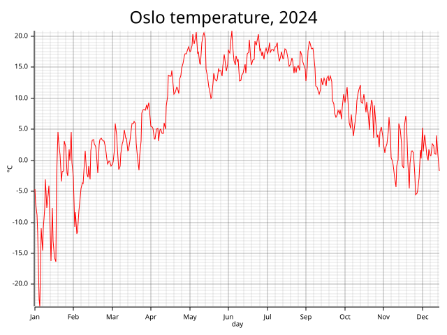
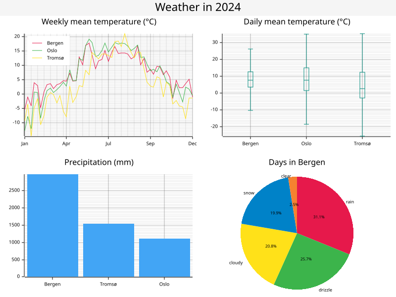

# plume

plume is a DuckDB v2 extension that draws charts from SQL with Rust's
[plotters](https://github.com/plotters-rs/plotters).
A chart is a SQL value built with plotters' own vocabulary, and output functions turn it into SVG or PNG,
write it to a file, or show it in the terminal, a window or a browser.

```sql
SELECT chart()
         .caption('Oslo temperature, 2024', 30)
         .configure_mesh().x_desc('day').y_desc('°C').x_label_formatter('%b').draw()
         .draw_series(line_series(day, temp).style('red'))
         .show()
FROM 'examples/weather.csv'
WHERE city = 'Oslo';
```



The examples in this README read [`examples/weather.csv`](examples/),
a year of real daily weather for three Norwegian cities, so they run as written from the repository root.

If you know plotters, you can mostly guess the SQL: `ChartBuilder::caption` is `caption`, `LineSeries` is `line_series`,
`MeshStyle::x_desc` is `x_desc`, and DuckDB's dot-call syntax
(`x.f(y)` is `f(x, y)`) makes the query read like the Rust chain.

## Status

plume is early, pre-release software.

- It targets **DuckDB v2**, which is itself in preview.
  plume is built against the stable v2 C API (`v2.0.0`), so one build per platform keeps loading across DuckDB
  releases, and it is tested against a pinned preview build, `v2.0.0-alpha43385`.
- There are no release binaries yet: you build it from source.
  It is not signed, so DuckDB loads it only with unsigned extensions allowed.
- The encoding of chart values can still change between versions.
  A `CHART` stored in a table by one plume may fail to decode in another (with a clear error).
- The optional `VISUALIZE` clause lives in a separate, [highly experimental shim](#the-visualize-clause-experimental).
  Everything else in this README is the core extension and needs no shim.

## Getting started

### Build

You need a Rust toolchain, `make`, `curl`, `jq` and Python 3.

```sh
make release    # build/release/plume.duckdb_extension
```

The file must keep the name `plume.duckdb_extension`: DuckDB derives the entrypoint from it.
[CONTRIBUTING.md](CONTRIBUTING.md) covers debug builds, cross-compiling and the tests.

### Load

In the DuckDB v2 shell:

```sh
duckdb -unsigned -cmd "LOAD 'build/release/plume.duckdb_extension'"
```

`make shell` downloads the pinned preview CLI into `.duckdb/` and starts it with a debug build loaded.

In Python, with the `duckdb` v2 preview wheel (`pip install --pre duckdb`):

```python
import duckdb
con = duckdb.connect(config={"allow_unsigned_extensions": "true"})
con.load_extension("build/release/plume.duckdb_extension")
```

### A first chart

```sql
SELECT plume_version();

-- Render to an SVG string.
SELECT chart().draw_series(line_series(i, i * i)).to_svg() FROM range(10) r(i);

-- Write a PNG file.
COPY (SELECT chart().draw_series(line_series(i, i * i)) FROM range(10) r(i)) TO 'squares.png';

-- Show it in the terminal (kitty, ghostty, WezTerm, iTerm2, foot, ...), a window or a browser tab.
SELECT chart().draw_series(line_series(i, i * i)).show() FROM range(10) r(i);
```

## How it works

A few rules cover the whole API.
The [design document](docs/design.md#the-plume-paradigm) has the full list and every name.

1. **Builders are values.**
   A chart, a mesh, a legend, a series and a font are SQL values of the types `CHART`, `MESH`, `SERIES_LABELS`,
   `SERIES` and `FONT`.
   Nothing is drawn until an output function such as `to_svg` or `show` runs.
   Every method returns a new value, so the same series can be drawn on several charts.
2. **Names are plotters names**, in snake_case, with the value as the first argument.
   Where a DuckDB built-in takes the name, the plotters receiver qualifies it:
   `Histogram::vertical` is `histogram_vertical`, `root.fill` is `root_fill`.
3. **Rows become series through aggregates.**
   `line_series(x, y)` consumes the rows of a group.
   Rows have no order, so a series is sorted by `x` unless `order_by := expr` says otherwise.
   `key := expr` splits one aggregate into a `SERIES[]`, one series per distinct key.
   A chart expression in a query with `GROUP BY` gives one chart per group.
4. **The chain is the Rust chain.**
   `configure_mesh()` returns a `MESH`, `configure_series_labels()` a `SERIES_LABELS`,
   and `draw()` on either returns the `CHART`.
   Draw order is chain order: a series drawn after the mesh paints over it.
5. **Closures become data.**
   Where plotters takes a closure, SQL takes a value: a format string for a label formatter, a marker name, a colour.
6. **The axis follows the data type.**
   Numeric values make a continuous axis, `DATE` and `TIMESTAMP` a time axis, `VARCHAR` a category axis.
7. **Defaults fill in where plotters would draw nothing.** plume infers ranges from the data, sizes the label areas,
   draws a default mesh first, colours series from `Palette99` in draw order,
   and draws a legend when a series has a label.
   Every one of these can be overridden with the plotters call.

Casting a plume value to `VARCHAR` gives a one-line summary, which is also how the DuckDB shell shows it:
`CHART(line, 2 series, 240 points)`, `SERIES(dashed line '0', 4 points)`, `CHART(grid 2x2, 3 charts)`.

Every scalar function returns `NULL` for a `NULL` argument.
Wrong argument types are bind errors; bad values
(an unknown colour, `x_range(1, 1)`, series with different x axis kinds on one chart)
are errors from the function that received them, using plotters' terms.

## Series

Series are aggregates.
Each takes `key :=` and `order_by :=`, and skips rows with a `NULL`, `NaN` or infinite value in any argument;
zero usable rows give an empty series.

| Aggregate | plotters | Notes |
|---|---|---|
| `line_series(x, y)` | `LineSeries` | |
| `dashed_line_series(x, y)` | `DashedLineSeries` | |
| `point_series(x, y)` | `PointSeries` | |
| `area_series(x, y)` | `AreaSeries` | filled down to the baseline |
| `histogram_vertical(bucket, value)` | `Histogram::vertical` | sums `value` per bucket; `histogram_vertical(x, 1)` counts rows |
| `histogram_horizontal(bucket, value)` | `Histogram::horizontal` | buckets on the y axis, bars rightwards |
| `error_bar_vertical(x, min, avg, max)` | `ErrorBar::new_vertical` | one per row |
| `error_bar_horizontal(y, min, avg, max)` | `ErrorBar::new_horizontal` | one per row |
| `candle_stick(x, open, high, low, close)` | `CandleStick` | one per row |
| `boxplot_vertical(bucket, value)` | `Boxplot::new_vertical` | one per bucket, with plotters' `Quartiles` |
| `boxplot_horizontal(bucket, value)` | `Boxplot::new_horizontal` | one per bucket |

- `x` (and the key of an error bar or candle) is a number, a `DATE`, any `TIMESTAMP` type or a `VARCHAR`.
  Histogram and boxplot buckets are `VARCHAR`, an integer or `DATE`; histograms also take `DOUBLE`,
  `FLOAT` and `DECIMAL` buckets with [`.step(s)`](#stepped-histograms).
- With `key := expr`, the series are ordered by key and labelled `key::VARCHAR`.
- Boxplot whiskers are at the fences, 1.5 IQR beyond the quartiles; values past them are not drawn.
  The first parameter is called `bucket` (plotters says `key`) because `key :=` is taken.

```sql
-- One line per city, each restyled with a lambda.
SELECT chart()
         .draw_series(list_transform(line_series(day, temp, key := city), lambda s: s.stroke_width(2)))
         .to_png()
FROM 'examples/weather.csv';

-- Bars in descending order.
SELECT chart().caption('Precipitation in 2024 (mm)')
         .draw_series(histogram_vertical(city, mm, order_by := -mm).style('blue_400'))
         .to_svg()
FROM (SELECT city, sum(precipitation) AS mm FROM 'examples/weather.csv' GROUP BY city);

-- Each month's lowest and highest temperature as error bars around its mean, over a line.
SELECT chart().caption('Oslo, per month').x_range(0, 13)
         .draw_series(line_series(m, mean).style('grey'))
         .draw_series(error_bar_vertical(m, lo, mean, hi).style('red').width(8).filled())
         .to_svg()
FROM (SELECT month(day) AS m, min(temp_min) AS lo, avg(temp) AS mean, max(temp_max) AS hi
      FROM 'examples/weather.csv' WHERE city = 'Oslo' GROUP BY m);
```

### Series methods

| Method | Applies to |
|---|---|
| `style(color [, stroke_width])`, `stroke_width(px)`, `label(text)` | every kind (except `style` on candles) |
| `filled()` | point and line markers, histogram bars, error-bar dots, candle bodies; an area is always filled |
| `point_size(px)` | lines (a dot at each point) |
| `size(px)` | points; the dash length of a dashed line |
| `spacing(px)` | dashed lines (the gap; 5 by default, as is the dash) |
| `marker(name)` | points: `'circle'`, `'cross'`, `'triangle'` or `'pixel'` |
| `margin(px)`, `step(s)` | histograms |
| `baseline(v)` | histograms and areas (default 0) |
| `border_style(color [, stroke_width])` | areas (transparent by default) |
| `width(px)` | error bars (end marks and dot), candles (body), boxplots (box); 10 by default |
| `gain_style(color)`, `loss_style(color)` | candles; `'green'` and `'red'` by default |

A method that does not apply to a series kind is an error that names the plotters term.
Series without a style are coloured from `Palette99` in draw order.
Legend glyphs follow the kind: a line, a dashed line, a filled rectangle for areas, a small error bar, candle or box.

## Charts

### Chart builder

On `CHART`, after plotters' `ChartBuilder` and `ChartContext`:

- `chart()` starts one, and `draw_series(series | series[])` draws on it.
- `caption(text [, size | font])`, `root_fill(color)`.
- `margin(px)`, `margin_top`, `margin_bottom`, `margin_left`, `margin_right`.
- `x_label_area_size(px)`, `y_label_area_size(px)`, `top_x_label_area_size(px)`, `right_y_label_area_size(px)`,
  `set_all_label_area_size(px)`, `set_left_and_bottom_label_area_size(px)`.
- `x_range(lo, hi)`, `y_range(lo, hi)`: numbers, dates or timestamps; `lo > hi` reverses the axis.
- `x_log_scale([base])`, `y_log_scale([base])`, `x_monthly()`, `x_yearly()`, `y_monthly()`, `y_yearly()`:
  see [Axes](#axes).
- `configure_mesh()`, `configure_series_labels()`, and the [secondary-axis](#secondary-axes) methods.

### Mesh

`configure_mesh()` returns a `MESH`; `draw()` returns the chart.
Without a `configure_mesh().draw()` in the chain, plume draws the default mesh before the first series.
The setters are `MeshStyle`'s, applied in chain order:

- Descriptions and labels: `x_desc(text)`, `y_desc(text)`, `axis_desc_style(size | font)`, `x_labels(n)`,
  `y_labels(n)`, `x_label_formatter(fmt)`, `y_label_formatter(fmt)`, `label_style(size | font)`,
  `x_label_style(size | font)`, `y_label_style(size | font)`, `x_label_offset(px)`, `y_label_offset(px)`.
- Lines: `x_max_light_lines(n)`, `y_max_light_lines(n)`, `max_light_lines(n)`, `light_line_style(color [, w])`,
  `bold_line_style(color [, w])`, `axis_style(color [, w])`.
- Switching off: `disable_x_mesh()`, `disable_y_mesh()`, `disable_mesh()`, `disable_x_axis()`, `disable_y_axis()`,
  `disable_axes()`.
- Ticks: `set_tick_mark_size(position, px)` (`'top'`, `'bottom'`, `'left'` or `'right'`), `set_all_tick_mark_size(px)`.
  Offsets and tick sizes may be negative, as in plotters.

### Legend

`configure_series_labels()` returns a `SERIES_LABELS`; `draw()` returns the chart.
A chain with a labelled series and no legend call gets the default legend last.
The setters: `position(name)` (`'upper_left'`, `'upper_right'`, ...), `position(x, y)`, `margin(px)`,
`legend_area_size(px)`, `border_style(color [, w])`, `background_style(color)`, `label_font(size | font)`.

```sql
SELECT chart()
         .caption('Oslo, styled mesh', font('serif', 24, 'bold'))
         .x_label_area_size(50).y_label_area_size(80)
         .configure_mesh()
           .x_desc('day').y_desc('temperature')
           .x_label_formatter('%b %d')
           .y_label_formatter('{:+.1f} °C')
           .label_style(font('sans-serif', 11).color('grey_700'))
           .light_line_style('blue_50').bold_line_style('blue_200', 1).axis_style('blue_900', 2)
           .disable_x_mesh()
           .draw()
         .draw_series(line_series(day, temp).style('red', 2).label('temp'))
         .configure_series_labels().position('upper_left').border_style('black')
           .background_style(mix('white', 0.85)).draw()
         .to_svg(800, 500)
FROM 'examples/weather.csv'
WHERE city = 'Oslo';
```

### Colours and fonts

- Colours are strings: plotters' names (`'red'`), `full_palette` names (`'blue_400'`), `'#rrggbb'`, `'#rrggbbaa'`,
  `'rgb(r, g, b)'`, `'rgba(r, g, b, a)'`, `'hsl(h, s, l)'` and `'palette99:n'`.
  `mix(color, alpha)` mirrors `WHITE.mix(0.8)`.
- `font(family, size [, style])` returns a `FONT`
  (`FontDesc::new`; style `'normal'`, `'bold'`, `'italic'` or `'oblique'`), and `color(font, color)` sets its colour.
  Every text-style parameter takes a bare size (sans-serif of that size) or a `FONT`.
- Text is laid out with an embedded DejaVu Sans, registered under every family a chart names,
  so rendering needs no system fonts and is deterministic.
  PNG output draws every family and style in that one regular face.
  SVG output writes the family, size and style into the file, and the viewer draws the text with its own fonts.

## Axes

### Label formatters

`x_label_formatter(fmt)` and `y_label_formatter(fmt)` take a string in place of plotters' formatter closure:

- On numeric, log, integer-bucket and category axes, a DuckDB `format()`-style template:
  literal text around exactly one `{}`, with `{{` and `}}` for literal braces.
  The placeholder takes an optional spec, `{:[[fill]align][sign][0][width][,][.precision][type]}`: `align` is `<`,
  `>` or `^`, `sign` is `+`, `-` or a space, `,` groups thousands,
  and `type` is `f` (fixed), `e` (exponent), `g` (general), `d` (rounded to an integer) or `%`
  (times 100, fixed, with a percent sign).
  A precision without a type is `g`.
  `{}` alone is the axis' own label, so `'{} °C'` adds a unit and nothing else.
  On a category axis only fill, alignment, width and precision apply (precision truncates the name).
- On date, timestamp and date-bucket axes, a chrono `strftime` pattern: `'%b %d'`, `'%H:%M'`.

The string is checked when it is set; whether it suits the axis is checked when the chart renders,
with an error naming the axis kind.
The last formatter call on an axis wins.

### Log scales

`x_log_scale([base])` and `y_log_scale([base])` use plotters' `LogCoord`, base 10 unless given.

- Only numeric axes take a log scale, including a histogram's value axis.
- Both bounds must be positive, whether they come from `x_range`/`y_range` or from the data.
  A histogram's extent includes its baseline, 0 by default,
  so bars on a log axis need `baseline(v)` with a positive value or an explicit range.
- Labels read `1`, `100`, `0.001`, `1e6`; a label formatter applies as on a linear axis.

```sql
SELECT chart()
         .x_log_scale().y_log_scale()
         .draw_series(line_series(x, x * x).label('x²'))
         .draw_series(point_series(x, x * x * x).marker('triangle').size(4).label('x³'))
         .to_svg()
FROM (SELECT pow(10, i / 10.0) AS x FROM range(0, 31) r(i));
```

### Monthly and yearly key points

`x_monthly()` and `x_yearly()` (and `y_monthly()`, `y_yearly()`) stand for plotters' `.monthly()` and `.yearly()`:
the axis keeps its range, and its labels and bold mesh lines fall on month or year starts.
Only date and timestamp axes take them.
The labels read `2024-1`, `2024-10`; a strftime formatter (`'%b'`, `'%Y'`) replaces them.
On a histogram or boxplot with `DATE` buckets the bands stay one per day; to bin by month, bin in SQL:
`histogram_vertical(date_trunc('month', day)::DATE, n)`.

```sql
SELECT chart().x_monthly()
         .draw_series(line_series(day, temp).style('red'))
         .to_svg(800, 400)
FROM 'examples/weather.csv'
WHERE city = 'Oslo';
```

### Stepped histograms

Histograms with numeric buckets need `.step(s)`, which bins them into bands of width `s`
(plotters' `(lo..hi).step(s).use_round().into_segmented()`):

```sql
SELECT chart()
         .configure_mesh().x_label_formatter('{:.0f}').draw()
         .draw_series(histogram_vertical(temp, 1).step(2).style('teal_400').margin(1))
         .to_svg()
FROM 'examples/weather.csv'
WHERE city = 'Oslo';
```

- Bin `k` holds the values from `k * s` up to `(k + 1) * s`, so bins start at multiples of `s` whatever the data.
  Floating-point noise does not move a value across a bin edge: `0.3` is in the bin of `0.3` for a step of `0.1`.
- The bands run from the lowest bin in the data to the highest, or cover `x_range(lo, hi)` when given.
- Each band is labelled with its bin's start.
  A line or point series drawn on a stepped axis goes to the centre of each value's bin.
- Integer buckets can be stepped too (`histogram_vertical(age, 1).step(10)`).

## Layout

`chart()`, `split_evenly`, `titled` and `pie` all return a `CHART`.
`root_fill`, `titled`, `split_evenly`, every output function and `COPY` work on any of them;
the builder methods work only on a `chart()`, and are errors naming the method elsewhere.

### Secondary axes

- `draw_secondary_series(series | series[])` draws against a second coordinate system,
  as `DualCoordChartContext::draw_secondary_series` does.
  Its ranges are the extent of the secondary series, or `secondary_x_range(lo, hi)` and `secondary_y_range(lo, hi)`.
  `set_secondary_coord()` exists, but these calls imply it.
- `configure_secondary_axes()` returns a `MESH` with `SecondaryMeshStyle`'s setters: `axis_style`,
  `x_label_offset`, `y_label_offset`, `x_labels`, `y_labels`, `x_label_formatter`, `y_label_formatter`,
  `axis_desc_style`, `x_desc`, `y_desc`, `label_style`, `set_all_tick_mark_size` and `set_tick_mark_size`.
- The secondary x axis must have the primary's kind; the secondary y axis can be any kind.
- Secondary series continue the primary series' colours and share the legend.

```sql
-- Precipitation bars on the right axis, temperature on the left one.
SELECT chart().caption('Bergen, 2024', 24)
         .y_range(-5, 20)
         .configure_mesh().y_desc('°C').draw()
         .configure_secondary_axes().y_desc('mm').y_label_formatter('{:.0f}').draw()
         .draw_secondary_series(histogram_vertical(month, rain, order_by := m)
                                  .style(mix('blue', 0.4)).label('precipitation'))
         .draw_series(line_series(month, temp, order_by := m).style('red', 2).point_size(3)
                        .label('temperature'))
         .configure_series_labels().position('upper_left').background_style('white').draw()
         .to_svg()
FROM (SELECT month(day) AS m, strftime(day, '%b') AS month, avg(temp) AS temp, sum(precipitation) AS rain
      FROM 'examples/weather.csv' WHERE city = 'Bergen' GROUP BY ALL);
```

### Grids and titles

- `split_evenly(charts, rows, cols)` takes a `CHART[]` and draws the charts row-major into a grid,
  as `DrawingArea::split_evenly((rows, cols))` does.
  A `NULL` element is a blank cell, and so are the cells past the last chart; more charts than cells is an error.
  `rows` and `cols` are 1 to 64, and a cell can be any chart, including another grid.
- `titled(chart, text [, size | font])` puts a title across the top, as `DrawingArea::titled` does
  (sans-serif 20 by default).
- `list(chart)` over a `GROUP BY` gives one grid cell per group.

```sql
SELECT split_evenly([
         (SELECT chart()
                   .configure_mesh().x_labels(4).x_label_formatter('%b').y_label_formatter('{:.0f}').draw()
                   .draw_series(line_series(week, temp, key := city))
                   .configure_series_labels().position('upper_left').background_style('white').draw()
          FROM (SELECT city, date_trunc('week', day)::DATE AS week, avg(temp) AS temp
                FROM 'examples/weather.csv' GROUP BY ALL))
           .titled('Weekly mean temperature (°C)'),
         (SELECT chart().configure_mesh().y_label_formatter('{:.0f}').draw()
                   .draw_series(boxplot_vertical(city, temp).style('teal_600'))
          FROM 'examples/weather.csv')
           .titled('Daily mean temperature (°C)'),
         (SELECT chart().configure_mesh().y_label_formatter('{:.0f}').draw()
                   .draw_series(histogram_vertical(city, mm, order_by := -mm).style('blue_400'))
          FROM (SELECT city, sum(precipitation) AS mm FROM 'examples/weather.csv' GROUP BY city))
           .titled('Precipitation (mm)'),
         (SELECT pie(days, weather, order_by := -days).start_angle(-90).label_style(11).percentages(10)
          FROM (SELECT weather, count(*) AS days FROM 'examples/weather.csv'
                WHERE city = 'Bergen' GROUP BY weather))
           .titled('Days in Bergen'),
       ], 2, 2)
         .root_fill('grey_100')
         .titled('Weather in 2024', 28)
         .to_svg(800, 600);
```



### Pies

`pie(size, label)` is an aggregate returning a `CHART`, one slice per row, coloured from `Palette99`.

- Slices are in label order unless `order_by :=` says otherwise.
  Rows with a `NULL`, `NaN`, infinite, zero or negative `size` are skipped.
- Methods, after plotters' `Pie`: `start_angle(deg)`
  (clockwise from three o'clock; `-90` starts at twelve),
  `label_style(size | font)`, `percentages(size | font)`
  (each slice's percentage inside it), `label_offset(px)` and `radius(px)`.
  Without `radius` the pie takes the largest radius that keeps every label inside its area.
- A pie has no `caption`; `titled` gives it a title.

```sql
SELECT pie(days, weather, order_by := -days)
         .start_angle(-90)
         .percentages(font('sans-serif', 12).color('white'))
         .to_svg()
FROM (SELECT weather, count(*) AS days FROM 'examples/weather.csv' WHERE city = 'Tromsø' GROUP BY weather);
```

## Output

### SVG and PNG values

`to_svg(chart [, width, height])` returns `VARCHAR`, `to_png(chart [, width, height])` returns `BLOB`.
The default size is 640×480 and the maximum 8192 px per side.

### Files

`COPY` renders the chart and writes the file:

```sql
COPY (SELECT chart().caption('Oslo').draw_series(line_series(day, temp)) FROM 'examples/weather.csv' WHERE city = 'Oslo')
TO 'oslo.png' (FORMAT png);

COPY (SELECT chart()) TO 'sized.svg' (FORMAT svg, WIDTH 300, HEIGHT 200);

-- One file per group.
COPY (SELECT city, chart().caption(city).draw_series(line_series(day, temp)) AS chart
      FROM 'examples/weather.csv' GROUP BY city)
TO 'cities' (FORMAT png, PARTITION_BY city, FILE_EXTENSION 'png');
```

- Without `FORMAT`, DuckDB takes the format from the file extension.
- Options: `WIDTH` and `HEIGHT` (640×480 by default), plus DuckDB's generic `COPY` options
  (`OVERWRITE`, `FILENAME_PATTERN`, `RETURN_FILES`, ...).
- The query gives exactly one column, of type `CHART`, and a file holds exactly one chart.
  More rows is an error that points at `PARTITION_BY`.
- With `PARTITION_BY`, `FILE_EXTENSION` is required
  (the v2 C API cannot declare one, so the files would be called `data_0.`);
  the example gives `cities/city=Bergen/data_0.png` and so on.
- A failed `COPY` leaves no file behind, and an existing file is replaced only by a successful one.
- **Local paths only.**
  For remote targets (`s3://`, `https://`, ...), use DuckDB's own blob format, which goes through its file system:

  ```sql
  COPY (SELECT chart().draw_series(line_series(i, i * i)).to_png(800, 600) FROM range(10) r(i))
  TO 's3://bucket/squares.png' (FORMAT blob);
  ```

### `show()`

`show()` renders a chart and hands it to a viewer.
It returns the chart unchanged, so it can sit anywhere in a query.

```sql
SELECT chart().draw_series(line_series(day, temp, key := city)).show() FROM 'examples/weather.csv';

SELECT chart().draw_series(line_series(cos(t), sin(t), order_by := t))
         .show(viewer := 'window', wait := true, width := 800, height := 800)
FROM (SELECT i / 20.0 AS t FROM range(126) r(i));
```

`show(chart, viewer := ..., wait := ..., width := ..., height := ...)`:

- `viewer`: `'auto'`, `'terminal'`, `'window'` or `'browser'`.
- `wait`: block until the window is closed (the window viewer only).
- `width`, `height`: the image size, 640×480 by default.
- A named argument left out or `NULL` takes its default.
  When no viewer works, the query fails with the reason for each viewer tried.

`'auto'` takes the first viewer that works:

1. **terminal**: an inline image (kitty graphics, iTerm2 or sixel), written to the controlling terminal,
   never to stdout, so redirected output stays clean.
   The protocol is picked from environment variables: kitty, ghostty and Konsole get kitty graphics,
   WezTerm and iTerm2 get iTerm2 images, foot and Windows Terminal get sixel.
   Other terminals (xterm, alacritty, VS Code), tmux, screen, and processes without a terminal skip it.
2. **window**: a native window titled `plume chart N`, closed with the title-bar button or Escape.
   Without `wait` the call returns once the window is up, and the window stays until closed or the process exits.
   On Linux it needs an X11 display (`DISPLAY`); Wayland desktops provide one through Xwayland.
3. **browser**: a self-contained HTML page in the cache directory
   (`~/.cache/plume`, `~/Library/Caches/plume`, `%LOCALAPPDATA%\plume`), opened with the system opener.
   Pages older than a day are removed on the next write.

#### Settings

| Key | Environment | Values | Default |
|---|---|---|---|
| `viewer` | `PLUME_VIEWER` | `auto`, `terminal`, `window`, `browser` | `auto` |
| `wait` | `PLUME_WAIT` | `true`/`false`, `1`/`0`, `yes`/`no`, `on`/`off` | `false` |
| `max_show` | | a non-negative integer | `10` |

```sql
SELECT plume_set('viewer', 'browser');
SELECT plume_get('wait');
```

The settings are process-wide, since an extension built on the C API cannot register `SET` options
(the experimental shim adds [`SET` options](#settings-with-set) on top).
The environment is read the first time a setting is needed.

`max_show` caps how many rows of one query open a viewer: the first `max_show` rows evaluated are shown,
and every row still returns its chart.
The count belongs to one `show()` call in one planned statement;
a prepared statement run many times keeps one count across its executions.

## Hosts

- **Python** returns plume values as `bytes`: a `CHART` is the encoded chart,
  `to_png()` gives PNG bytes and `to_svg()` a `str`.
  Cast to `VARCHAR` for the summary.
  Python evaluates the `SELECT` list when the result is fetched,
  so `show()` and `plume_set()` act on `.fetchall()` or similar, not on `execute`.
- **Jupyter** kernels have no controlling terminal, so `show()` opens a window or a browser tab
  (on the kernel's machine).
  For inline display, pass `to_png()` or `to_svg()` to IPython:

  ```python
  from IPython.display import Image, SVG

  Image(con.sql("SELECT chart().draw_series(line_series(i, i * i)).to_png() FROM range(10) r(i)").fetchone()[0])
  SVG(con.sql("SELECT chart().draw_series(line_series(i, i * i)).to_svg() FROM range(10) r(i)").fetchone()[0])
  ```

- **R and Node** have not been tried.
  Values should come back as the client's blob type, and the same `to_png()`/`to_svg()` route applies
  (for instance `IRdisplay::display_png()` in an R Jupyter kernel).
  `COPY` behaves the same everywhere, since the engine runs it.

## Platforms

CI builds and tests the core on Linux (x86_64 and arm64), macOS (arm64) and Windows (x86_64).
`show()` has been verified by hand on Linux (sway with Xwayland, ghostty).
On macOS and Windows its behaviour is inferred from source and documentation and not yet confirmed:
[`docs/manual-acceptance-show.md`](docs/manual-acceptance-show.md) lists the checks.

## Limitations

- **`ORDER BY` inside a series aggregate is ignored**
  (`line_series(x, y ORDER BY t)`),
  and **`line_series(x, y) OVER ()` crashes DuckDB**: both are the same DuckDB v2 bug with C-API aggregates
  ([duckdb#26109](https://github.com/duckdb/duckdb/issues/26109)).
  Use `order_by := t`.
- **Ctrl-C does not close a waiting window**, since DuckDB gives a scalar function no way to notice an interrupt.
- **macOS** allows windows only on the main thread, so the window viewer works there only with `wait := true` when
  DuckDB runs the call on the main thread (`SET threads = 1` makes that likely); otherwise `'auto'` goes to the
  browser.
- **Wayland without Xwayland** has no window viewer by default.
  Native Wayland windows are a build option
  (see [CONTRIBUTING.md](CONTRIBUTING.md#building));
  they make the Wayland client library print "queue ... destroyed
  while proxies still attached" to stderr each time a window closes.
- The browser cannot close its tab when DuckDB exits, and snap-packaged browsers cannot read `~/.cache`.
- The shell's `json` output mode prints the elements of a `SERIES[]` as raw bytes.
- The default label areas are sized for numbers: long category names or formatted labels need
  `x_label_area_size`/`y_label_area_size`.
- A horizontal histogram's first bucket is at the bottom, as in plotters:
  `order_by := n` puts the largest bar on top.
- The data extent has no padding (plotters' behaviour), so the outer candles, error bars and boxes are cut in half
  at the edge; `x_range` gives them room.
- Not exposed: plotters' relative tick sizes (`5.percent()`), `Boxplot::whisker_width` and `offset`,
  `Pie::donut_hole`, per-slice colours, scale calls on secondary axes, and grouped bars.
- plotters draws a boxplot's box unfilled, the `Pixel` marker as one pixel whatever its size, and an explicit pie
  `radius` past its area.

## The `VISUALIZE` clause (experimental)

> [!WARNING]
> The `VISUALIZE` shim is **highly experimental and unstable**.
> It is built on DuckDB v2's grammar-extension API, which is still changing, and it may change or break at any time.
> It loads only into the exact DuckDB build it was compiled for, there are no binaries,
> and building it compiles DuckDB from source.
> Nothing in the core depends on it: every example above works without it.

`plume_visualize` is a second, small extension in C++ that adds a `VISUALIZE` clause to DuckDB's parser:

```sql
SELECT day, temp FROM 'examples/weather.csv' WHERE city = 'Oslo'
VISUALIZE chart().caption('Oslo').draw_series(line_series(day, temp)).show();
```

`<query> VISUALIZE <targets>` means `SELECT <targets> FROM (<query>)`, and `VISUALISE` is the same word.
It adds no functions of its own.

- The query is any `SELECT`, with CTEs, `GROUP BY`, `ORDER BY`, `LIMIT` or set operations.
  The series aggregates in the chart expression consume its rows,
  and they sort by `x` whatever the query's `ORDER BY` says.
- It is a statement suffix: `EXPLAIN` and `PREPARE` take it, but a subquery, a view body and `COPY (...) TO` do not.
- While the grammar is active, `visualize` and `visualise` are reserved words and need quotes as bare identifiers.

### Using it

Build it with `make shim` (it needs `cmake`, `git` and a C++17 compiler, and compiles DuckDB the first time), then,
in the pinned preview DuckDB (`v2.0.0-alpha43385`) with unsigned extensions allowed:

```sql
LOAD 'build/shim/plume_visualize.duckdb_extension';
SET active_grammar_extensions = ['plume_visualize'];
```

`make shell_shim` does all of this.
Loading the shim loads the core too, from the `plume.duckdb_extension` next to it or the installed one.
The grammar is switched on per connection, and `RESET active_grammar_extensions` switches it off;
`~/.duckdbrc` is the place to switch it on for the shell.
Any other DuckDB build refuses the shim with a version mismatch.
It has been run on Linux (x86_64), CI tests it on macOS (arm64) too, and Windows has not been tried.

### Settings with `SET`

The shim registers session settings for `show()`,
which take precedence over the process-wide ones while `show()`'s named arguments take precedence over both:

| Setting | Type | Values |
|---|---|---|
| `plume_viewer` | `VARCHAR` | `auto`, `terminal`, `window`, `browser` |
| `plume_wait` | `BOOLEAN` | |
| `plume_max_show` | `UBIGINT` | `0` shows nothing |

```sql
SET plume_viewer = 'browser';
SET plume_max_show = 3;
```

Each defaults to `NULL`, meaning the process-wide setting, so loading the shim changes nothing until a `SET`,
and `RESET` goes back.
`plume_get` keeps reporting the process-wide value; `current_setting('plume_viewer')` reads the session's.

## Further reading

- [`docs/design.md`](docs/design.md): the paradigm, the full API tables, and the decisions behind them.
- [`docs/reports/`](docs/reports/): the research on DuckDB v2's C API, parser extensibility, plotters and prior art.
- [CONTRIBUTING.md](CONTRIBUTING.md): building, testing and the code layout.
